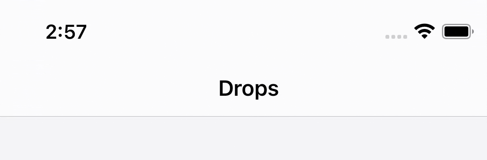
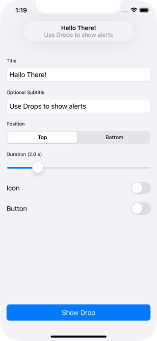

# Drops 💧

A µFramework for showing iOS 13 like alerts.



---

## Features / Todos

- [x] iOS 11+
- [x] Light/dark mode
- [x] Show with custom duration
- [x] Show from top or buttom of screen
- [x] Interactive dismissal
- [x] Queue multiple drops
- [ ] VoiceOver support
- [ ] Accessibility checkup
- [ ] SwiftUI support
- [ ] Add tests
- [ ] Add basic CI with Github Actions

---

## Usage

1. Create a drop:

```swift
let drop = Drop(title: "Title", subtitle: "Subtitle")
```

2. Present it:

```swift
Drops.show(drop)
```

---

## Example Project

Clone the repo and run the `Example` target



---

## Installation

### Swift Package Manager

The [Swift Package Manager](https://swift.org/package-manager/) is a tool for managing the distribution of Swift code.

1. Add the following to your `Package.swift` file:

```swift
dependencies: [
    .package(url: "https://github.com/omaralbeik/drops.git", from: "0.2.0")
]
```

2. Build your project:

```sh
$ swift build
```

---

## Thanks

Special thanks to [SwiftKickMobile team](https://github.com/SwiftKickMobile) for creating [SwiftMessages](https://github.com/SwiftKickMobile/SwiftMessages), this project was heavily inspired by their work.

---

## License

Drops is released under the MIT license. See [LICENSE](LICENSE) for more information.
